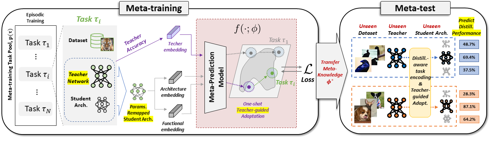

# Meta-prediction Model for Distillation-Aware NAS on Unseen Datasets
This is the official **PyTorch implementation** for the paper Meta-prediction Model for Distillation-Aware NAS on Unseen Datasets (**ICLR 2023 Notable-top-25% Spotlight**) : https://openreview.net/forum?id=SEh5SfEQtqB.

## Abstract
Distillation-aware Network Architecture Search (DaNAS) aims to search for an optimal student architecture that obtains the best performance and/or efficiency when distilling the knowledge from a given teacher model. Previous DaNAS methods have mostly tackled the search for the network architecture for fixed source/target tasks and the teacher, which are not generalized well on a new task, thus need to perform a costly search for any new combination of the domains and the teachers. For standard NAS tasks without KD, meta-learning-based computationally efficient NAS methods have been proposed, which learn the generalized search process over multiple tasks and transfer the knowledge obtained over those tasks to a new task. However, since they assume learning from scratch without KD from a teacher, they might not be ideal for DaNAS scenarios, which could significantly affect the final performances of the architectures obtained from the search. To eliminate the excessive computational cost of DaNAS methods and the sub-optimality of rapid NAS methods, we propose a distillation-aware meta accuracy prediction model, DaSS (Distillation-aware Student Search), which can predict a given architecture’s final performances on a dataset when performing KD with a given teacher, without having actually to train it on the target task. The experimental results demonstrate that our proposed meta-prediction model successfully generalizes to multiple unseen datasets for DaNAS tasks, largely outperforming existing meta-NAS methods and rapid NAS baselines.

__Framework of DaSS Model__



## Installation
```
$ conda env create -f dass.yaml
```

## Download datasets, checkpoints, preprocessed features
```
$ python download/download_dataset.py --name all
$ python download/download_checkpoint.py 
$ python download/download_preprocessed.py 
$ rm preprocessed.zip
```

## Meta-training DaSS model

You can download trained checkpoint files for generator and predictor
```
$ bash script/run_meta_train.sh [GPU_NUM]
```

## Rapid search using meta-learned DaSS model on unseen datasets 
```
# bash script/run_search.sh [GPU_NUM]
```

## Knowledge distillation (KD) for searched student on target unseen dataset
```
$ bash script/run_kd.sh GPU_NUM DATASET_NAME
$ bash script/run_kd.sh 0 cub
$ bash script/run_kd.sh 0 dtd
$ bash script/run_kd.sh 0 quickdraw
$ bash script/run_kd.sh 0 stanford_cars
```


## Citation
If you found the provided code useful, please cite our work.
```
@inproceedings{
lee2023metaprediction,
title={Meta-prediction Model for Distillation-Aware {NAS} on Unseen Datasets},
author={Hayeon Lee and Sohyun An and Minseon Kim and Sung Ju Hwang},
booktitle={The Eleventh International Conference on Learning Representations },
year={2023},
url={https://openreview.net/forum?id=SEh5SfEQtqB}
}
